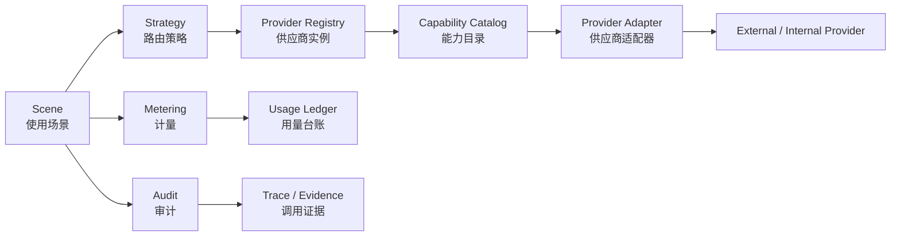

# PRD: Nexus Provider 聚合与 Scene 编排重构

> 更新时间: 2026-05-11
> 状态: Architecture PRD / Partial Implementation
> 适用范围: `apps/nexus`、`apps/core-app`、`packages/*`

## 1. 背景

当前 Nexus 已经承载汇率、AI providers、发布与生态文档等能力，但供应商配置仍按业务域分散演进：

- 汇率能力由独立 `exchangeRateService` 与 `/api/exchange/*` 口径维护。
- AI 大模型 providers 主要面向 Intelligence / AI 配置，尚未沉淀为 Nexus 通用 Provider registry。
- 文本翻译、图片翻译、截图翻译等新能力如果继续按场景单独建供应商模型，会造成配置、计量、审计、fallback 与配额重复实现。

本 PRD 将 Nexus 升级为统一 Provider 聚合中心：Provider 独立声明能力，Scene 按使用场景自由组合 capability 与路由策略。

## 2. 最终目标

Nexus 提供统一的 Provider registry、Capability catalog、Scene orchestration 与 Metering/Audit 基线，让汇率、AI 大模型、文本翻译、图片/截图翻译使用同一套供应商模型。

业务目标：后续新增“某个场景需要外部能力”时，只新增 Scene 或 capability binding，不新增孤立供应商配置页。

工程目标：Provider 元数据、鉴权引用、计量规则、健康状态、fallback trace 与用量台账只维护一套 registry / orchestrator，不在汇率、AI、翻译各模块重复实现。

### 2.1 North Star

- **Provider 独立**: 供应商只描述自己能做什么、如何鉴权、如何计量、健康状态如何。
- **Scene 自由组合**: 使用场景不绑定单个供应商，而是声明需要哪些 capability 与策略。
- **Strategy 可审计**: 路由选择、fallback、成本/延迟/可用性判断可记录、可解释、可回放。
- **Metering 统一**: 字符、token、调用次数、图片次数、文件页数、音频秒数等计量统一建模。
- **配置可迁移**: 现有汇率与 AI providers 迁移到同一 registry，不再保留孤立供应商配置页。

### 2.2 范围

首版覆盖：

- Nexus Provider registry 与 Capability catalog 的数据模型、管理入口与查询接口。
- Scene Orchestrator 的最小执行合同：`sceneId + input + strategy -> output + trace + usage`。
- `exchangeRateService`、Nexus dashboard AI providers 的迁移映射，以及文本翻译、图片/截图翻译的新增 Provider 配置与 Scene 绑定设计。
- Metering、Audit、Fallback Trail、Provider Health 的统一字段与落库边界。
- CoreApp 侧调用只通过 typed transport / domain SDK 消费 Scene，不直接读取 Nexus provider 表结构。

暂不覆盖：

- 新增真实云厂商 API adapter 的完整实现。
- 重写 Intelligence runtime、AI 路由器或现有模型推理链。
- 改变当前线上计费价格、套餐权益或支付链路。
- 将本地 UI 渲染能力强制云端化。

## 3. 核心模型

### 3.1 Provider

Provider 是供应商实例，代表一个可鉴权、可健康检查、可计量的能力来源。

示例：

- `tencent-cloud-mt-main`: 腾讯云机器翻译主账号。
- `openai-main`: OpenAI 主账号。
- `deepseek-main`: DeepSeek 主账号。
- `exchange-rate-official`: 官方汇率数据源。

Provider 不直接等于场景。一个 Provider 可以暴露多个 capability。

```ts
interface ProviderDescriptor {
  id: string
  vendor: 'tencent-cloud' | 'openai' | 'deepseek' | 'exchange-rate' | 'custom'
  displayName: string
  authRef: string
  status: 'enabled' | 'disabled' | 'degraded'
  authType: 'api_key' | 'secret_pair' | 'oauth' | 'none'
  ownerScope: 'system' | 'workspace' | 'user'
  capabilities: ProviderCapabilityDescriptor[]
  healthCheck?: ProviderHealthCheck
  tags?: string[]
}
```

### 3.2 Capability

Capability 是能力单元，只描述输入、输出、约束和计量方式。

首版能力域：

- `text.translate`
- `image.translate`
- `image.translate.e2e`
- `vision.ocr`
- `overlay.render`
- `fx.rate.latest`
- `fx.convert`
- `chat.completion`
- `text.summarize`

```ts
interface ProviderCapabilityDescriptor {
  id: string
  capability: string
  inputSchemaRef: string
  outputSchemaRef: string
  metering: MeteringRule
  constraints?: {
    maxPayloadBytes?: number
    maxImagePixels?: number
    supportedLanguages?: string[]
    supportedMimeTypes?: string[]
    latencyClass?: 'realtime' | 'interactive' | 'batch'
  }
  metadata?: Record<string, string | number | boolean>
}
```

### 3.3 Scene

Scene 是使用场景，负责声明业务意图、能力组合、策略和审计边界。

首版 Scene：

- `corebox.screenshot.translate`: CoreBox 截图翻译。
- `corebox.selection.translate`: 划词翻译。
- `corebox.fx.convert`: CoreBox 汇率换算。
- `intelligence.chat`: AI Chat。
- `document.summary`: 文档总结。
- `image.translate.pin`: 图片翻译 pin window。

```ts
interface SceneDescriptor {
  id: string
  displayName: string
  owner: 'nexus' | 'core-app' | 'aiapp' | 'plugin'
  requiredCapabilities: SceneCapabilityRequirement[]
  strategy: StrategyDescriptor
  meteringPolicy: SceneMeteringPolicy
  auditPolicy: SceneAuditPolicy
}
```

### 3.4 Strategy

Strategy 描述 Provider 选择规则。

首版策略模式：

- `priority`: 固定优先级，失败后 fallback。
- `least_cost`: 在满足质量与延迟约束下优先低成本。
- `lowest_latency`: 优先低延迟。
- `balanced`: 综合成本、延迟、成功率与可用性。
- `manual`: 用户或管理员显式选择。

当前最小实现已让 strategy 参与 Scene Orchestrator 路由：`priority/manual` 使用 priority、weight、providerId 排序；`least_cost` 读取 binding constraints 或 provider capability metering/metadata 中的成本字段；`lowest_latency` 读取 `provider_health_checks` 最新 latency；`balanced` 综合成本、延迟与权重后再回退到 priority 排序。完整 success rate、配额、区域、语言质量与动态 `pricingRef` 成本估算仍属于后续策略层增强。

```ts
interface StrategyDescriptor {
  mode: 'priority' | 'least_cost' | 'lowest_latency' | 'balanced' | 'manual'
  fallback: 'enabled' | 'disabled'
  candidates: Array<{
    providerId: string
    capability: string
    weight?: number
    priority?: number
  }>
  constraints?: {
    maxEstimatedCost?: number
    maxLatencyMs?: number
    requireLocalOnly?: boolean
  }
}
```

### 3.5 Metering

Metering 是计量规则，不属于某个 Scene 的私有逻辑。

首版计量单位：

- `character`
- `token`
- `request`
- `image`
- `page`
- `audio_second`
- `fx_quote`

```ts
interface MeteringRule {
  unit: 'character' | 'token' | 'request' | 'image' | 'page' | 'audio_second' | 'fx_quote'
  billableOn: 'success' | 'request_accepted'
  settlement: 'free_quota' | 'prepaid' | 'postpaid' | 'internal'
  pricingRef?: string
}

interface MeteringUsage {
  unit: MeteringRule['unit']
  quantity: number
  billable: boolean
  pricingRef?: string
  providerUsageRef?: string
}
```

## 4. 目标架构



### 4.1 Registry 职责

- 统一保存 Provider 元数据、能力列表、健康状态与鉴权引用。
- 不保存明文密钥。密钥进入系统安全存储，registry 只保存 `authRef`。
- 对外提供能力查询：按 capability、语言、成本、延迟、可用性过滤 Provider。

### 4.2 Scene Orchestrator 职责

- 接收 Scene 请求，解析所需能力链。
- 调用 Strategy 选择 Provider。
- 记录调用 trace、用量、fallback 过程与错误码。
- 返回与 Scene 对齐的业务结果，不泄露供应商私有响应结构。

### 4.3 Provider Adapter 职责

- 只负责把标准 capability payload 转换为供应商 API 请求。
- 标准化错误码、usage、latency、providerRequestId。
- 不持有 Scene 逻辑，不决定业务 fallback。

## 5. 腾讯云机器翻译 Provider 配置示例

Nexus 当前没有面向截图翻译、图片翻译或腾讯云机器翻译的现成 Provider 配置页，也没有可迁移的场景专属供应商模型。腾讯云机器翻译在本 PRD 中是新增 Provider 配置面的首个候选样例：后续实现需要在 Nexus Provider registry 中新增供应商实例、密钥绑定、capability 启用和 Scene strategy binding，而不是从某个既有“截图翻译配置”迁移。

腾讯云机器翻译文档显示，该产品覆盖文本翻译、文件翻译、图片翻译、端到端图片翻译与语音翻译等子产品，并提供免费额度、预付费和后付费扣费顺序。文本翻译按字符计量，图片翻译与语音翻译按调用次数计量，端到端图片翻译按次数并支持日度阶梯计费；调用失败不计费。

资料来源: https://cloud.tencent.com/document/product/551/35017

```ts
const tencentCloudMachineTranslationProvider: ProviderDescriptor = {
  id: 'tencent-cloud-mt-main',
  vendor: 'tencent-cloud',
  displayName: 'Tencent Cloud Machine Translation',
  authRef: 'secure://providers/tencent-cloud-mt-main',
  status: 'enabled',
  authType: 'secret_pair',
  ownerScope: 'system',
  tags: ['translation', 'vision', 'cloud'],
  capabilities: [
    {
      id: 'tencent-cloud-mt-text-translate',
      capability: 'text.translate',
      inputSchemaRef: 'schema://capabilities/text.translate.input.v1',
      outputSchemaRef: 'schema://capabilities/text.translate.output.v1',
      metering: {
        unit: 'character',
        billableOn: 'success',
        settlement: 'free_quota',
        pricingRef: 'pricing://tencent-cloud/machine-translation/text'
      }
    },
    {
      id: 'tencent-cloud-mt-image-translate',
      capability: 'image.translate',
      inputSchemaRef: 'schema://capabilities/image.translate.input.v1',
      outputSchemaRef: 'schema://capabilities/image.translate.output.v1',
      metering: {
        unit: 'image',
        billableOn: 'success',
        settlement: 'postpaid',
        pricingRef: 'pricing://tencent-cloud/machine-translation/image'
      }
    },
    {
      id: 'tencent-cloud-mt-image-translate-e2e',
      capability: 'image.translate.e2e',
      inputSchemaRef: 'schema://capabilities/image.translate.e2e.input.v1',
      outputSchemaRef: 'schema://capabilities/image.translate.e2e.output.v1',
      metering: {
        unit: 'image',
        billableOn: 'success',
        settlement: 'prepaid',
        pricingRef: 'pricing://tencent-cloud/machine-translation/image-e2e'
      }
    }
  ]
}
```

关键约束：

- 同一腾讯云 Provider 暴露多个 capability，不拆成“文本翻译供应商页”“图片翻译供应商页”“截图翻译供应商页”。
- 腾讯云的字符、图片次数、端到端图片次数等计费规则进入 Metering，不写死在 Scene。
- 腾讯云只是示例 Provider，架构不得绑定单一云厂商。
- 文档外部价格与额度会变化，落地实现必须把供应商价格信息作为可更新 `pricingRef` 配置，不把数值硬编码进业务代码。

## 6. Scene 编排示例

### 6.1 截图翻译

目标流程：

1. 用户复制图片或在 CoreBox 选择“截图翻译”。
2. CoreBox 将图片输入交给 `corebox.screenshot.translate` Scene。
3. Scene 根据策略选择直接 `image.translate.e2e`，或组合 `vision.ocr + text.translate + overlay.render`。
4. 结果在新 pin window 展示：保留原图视觉上下文，覆盖或替换为译文层。
5. pin window 可拖动、可置顶、可关闭，审计记录仅保留安全元数据与用量。

可选编排：

```text
corebox.screenshot.translate
  strategy A: image.translate.e2e
  strategy B: vision.ocr -> text.translate -> overlay.render
```

### 6.2 图片翻译

```text
image.translate.pin
  direct: image.translate
  composed: vision.ocr -> text.translate -> overlay.render
```

### 6.3 汇率换算

```text
corebox.fx.convert
  fx.rate.latest -> fx.convert
```

`exchangeRateService` 迁移为 `fx.rate.latest` / `fx.convert` capability。CoreBox 汇率换算不再直接绑定某个汇率服务实现，而是请求 Scene。

### 6.4 AI Chat

```text
intelligence.chat
  chat.completion
```

现有 Nexus dashboard AI providers 迁移到 Provider registry 的 `ai.*` / `chat.*` capability 域。`intelligence-power-generic-api-prd.md` 继续作为 Intelligence 能力路由细化文档，本 PRD 将其 Provider 抽象上升为 Nexus 通用 Provider registry 的一个能力域。

### 6.5 文档总结

```text
document.summary
  file.extract_text -> text.summarize
```

后续可按文件类型扩展 `file.extract_text`、`vision.ocr` 与 `text.summarize` 组合，不需要新建“文档总结供应商”。

## 7. 现有模块迁移方向

### 7.1 汇率

- 当前: `exchangeRateService` 独立提供 latest / convert 能力。
- 关联现状:
  - `apps/nexus/server/utils/fxRateProviderClient.ts`
  - `apps/core-app/src/main/modules/system-update/index.ts`
  - `apps/core-app/src/main/modules/box-tool/addon/preview/providers`
- 目标: 迁移为 Provider capability：
  - `fx.rate.latest`
  - `fx.convert`
- 迁移要求:
  - API 外形可保持兼容，但内部调用 Provider registry。
  - 汇率数据源的更新时间、下一次更新时间与来源进入 capability metadata。
  - 用量记录进入 Metering，单位为 `fx_quote` 或 `request`。

### 7.2 AI Providers

- 当前: Nexus dashboard AI providers 偏 Intelligence/AI 使用。
- 关联现状:
  - `apps/nexus/app/pages/dashboard/admin/intelligence.vue`
  - `apps/nexus/server/api/dashboard/intelligence/providers*`
  - `apps/core-app/src/main/modules/ai/*`
  - `packages/tuff-intelligence/*`
- 目标: 迁移为通用 Provider registry 的 `chat.completion`、`text.summarize`、`vision.ocr`、`image.generate` 等 capability。
- 迁移要求:
  - Intelligence 现有策略引擎保留领域细节，但 Provider 元数据和鉴权引用统一注册。
  - AI Chat Scene 消费 `chat.completion`，不直接读取 provider 配置页结构。
  - `intelligence-power-generic-api-prd.md` 中的 Intelligence provider / strategy 概念降为 AI 能力域的专用策略层，不再作为 Nexus 之外的第二套 provider 元数据源。

### 7.3 翻译与图片翻译

- 当前: Nexus 尚未提供截图翻译、图片翻译、划词翻译或腾讯云机器翻译的 Provider 配置；没有可迁移的场景专属供应商页。
- 目标: 新增通用 Provider 配置面，首版接入文本翻译、图片翻译、截图翻译相关 capability。
- 迁移要求:
  - 不为“截图翻译”“划词翻译”“图片翻译”分别新增孤立供应商配置页。
  - 翻译能力统一进入 Provider registry，通过 Scene 决定组合和路由。
  - Nexus 需要新增供应商创建/编辑入口，支持腾讯云 `secret_pair` 绑定、capability 勾选、健康检查与 Scene strategy binding。

### 7.4 迁移映射表

| 当前能力/配置 | 目标 Provider/Capability | 目标 Scene | 兼容要求 |
| --- | --- | --- | --- |
| Nexus 汇率 provider / `exchangeRateService` | `exchange-rate-official` + `fx.rate.latest` / `fx.convert` | `corebox.fx.convert` | `/api/exchange/*` 外形可保持兼容，内部路由切到 Scene；失败返回明确 degraded / unavailable。 |
| Nexus dashboard AI providers | `openai-*` / `deepseek-*` / custom provider + `chat.completion` / `text.summarize` / `vision.ocr` | `intelligence.chat` / `document.summary` | 现有 Intelligence strategy 保留为 AI 能力域策略，Provider 元数据与 authRef 迁入 registry。 |
| CoreBox 划词翻译（新增能力） | translation provider + `text.translate` | `corebox.selection.translate` | Nexus 需先新增 translation provider 配置与 capability binding；调用方只传文本、源语言、目标语言与审计上下文，不指定供应商私有参数。 |
| CoreBox 截图翻译（新增能力） | translation/vision provider + `image.translate.e2e` 或 `vision.ocr` / `text.translate` / `overlay.render` | `corebox.screenshot.translate` | Nexus 需先新增截图翻译可用 Provider 配置；必须支持 direct 与 composed 两条策略，并记录 fallback trail。 |
| 图片翻译 pin window（新增能力） | translation/vision provider + `image.translate` 或 composed path | `image.translate.pin` | Nexus 需先新增图片翻译 capability binding；pin window 只消费 Scene 输出，不读取 provider 私有响应。 |

### 7.5 兼容边界

- 对外 API 可以在迁移期保持旧路径，但实现必须转发到 Provider registry / Scene Orchestrator，不新增旧 service 分支。
- 旧配置迁移采用 read-once 或 append-only migration，迁移失败时旧配置只读保留，并暴露明确迁移错误。
- 新增 provider / scene 不允许复用旧 raw channel 字符串；CoreApp、Nexus、插件侧均通过 typed transport 或 domain SDK。
- 历史 provider 配置中的明文密钥不得原样迁入 registry；必须重新绑定到系统安全存储后只保留 `authRef`。

## 8. 数据与接口草案

### 8.1 Registry API

```ts
interface ProviderRegistry {
  listProviders(filter?: ProviderFilter): Promise<ProviderDescriptor[]>
  getProvider(providerId: string): Promise<ProviderDescriptor | null>
  upsertProvider(input: ProviderUpsertInput): Promise<ProviderDescriptor>
  setProviderStatus(providerId: string, status: ProviderDescriptor['status']): Promise<void>
  listCapabilities(filter?: CapabilityFilter): Promise<ProviderCapabilityDescriptor[]>
}
```

### 8.2 Scene API

```ts
interface SceneOrchestrator {
  run<TInput, TOutput>(
    sceneId: string,
    input: TInput,
    options?: SceneRunOptions
  ): Promise<SceneRunResult<TOutput>>
}

interface SceneRunResult<TOutput> {
  output: TOutput
  traceId: string
  providerId: string
  capabilityPath: string[]
  usage: MeteringUsage[]
  fallbackTrail?: StrategyFallbackRecord[]
}
```

### 8.3 Storage / Security 约束

- Provider registry 的结构化元数据进入 SQLite。
- Provider credential 只通过安全存储引用，不进入 `provider_registry` 明文字段。
- 密钥、SecretId/SecretKey、API key、OAuth refresh token 不允许进入 JSON、localStorage、日志或明文 SQLite 字段。
- 同步载荷如需跨设备同步，只同步密文引用或非敏感配置；敏感凭证必须由本机安全存储重新绑定。
- Usage Ledger 只记录计量单位、数量、Scene、Provider、Capability、Trace ID、错误码与成本估算引用，不记录原文 prompt、图片内容、截图内容或完整翻译文本。

### 8.4 建议数据表

| 表 | 责任 | 敏感边界 |
| --- | --- | --- |
| `provider_registry` | Provider 基础元数据、vendor、status、ownerScope、authRef、health summary | `authRef` 只能是安全存储引用，不是密钥值。 |
| `provider_capabilities` | capability、schemaRef、constraints、metering、metadata | 不保存供应商私有 credential。 |
| `scene_registry` | Scene 定义、owner、requiredCapabilities、auditPolicy、meteringPolicy | 不保存用户输入内容。 |
| `scene_strategy_bindings` | Scene 到 Provider capability 的候选、权重、优先级、约束 | 成本只保存 `pricingRef` 或估算配置引用。 |
| `provider_usage_ledger` | Scene run 的 usage、billable、traceId、providerId、capabilityPath | 禁止保存原文、图片、截图、完整模型响应。 |
| `provider_audit_traces` | fallback trail、错误码、latency、providerRequestId hash、degraded reason | providerRequestId 进入 hash 或安全截断，不保存可复用 token。 |

### 8.5 错误码基线

| 错误码 | 含义 | 用户可见策略 |
| --- | --- | --- |
| `PROVIDER_UNAVAILABLE` | Provider disabled、health check failed 或网络不可达 | 显示供应商不可用，并建议切换策略或稍后重试。 |
| `CAPABILITY_UNSUPPORTED` | Scene 需要的 capability 没有可用 Provider | 显示当前能力未配置。 |
| `AUTH_REQUIRED` | Provider 缺少或失效的 `authRef` | 引导管理员重新绑定凭证。 |
| `QUOTA_EXCEEDED` | 用户、workspace 或 provider quota 超限 | 显示额度不足或达到限制。 |
| `METERING_FAILED` | 调用成功但 usage 记录失败 | 不伪造成功结算；返回 partial success 并进入审计告警。 |
| `SCENE_DEGRADED` | fallback 后成功，但存在降级 | 返回结果并展示降级来源。 |

## 9. 实施阶段

### Phase 1: 类型模型与 registry 文档化

- 固定 Provider / Capability / Scene / Strategy / Metering 类型。
- 明确 registry 与 Intelligence 现有 Provider 抽象的关系。
- 产出迁移清单和 API 草案。
- 文档同步：README、TODO、CHANGES、INDEX、Roadmap、Quality Baseline 保持入口一致。

### Phase 1.5: Nexus 后端 registry 基础实现

- 已新增 `apps/nexus/server/utils/providerRegistryStore.ts`，提供 `provider_registry` 与 `provider_capabilities` D1 表、provider CRUD、capability 查询和安全输入校验。
- 已新增 `/api/dashboard/provider-registry/providers*` 与 `/api/dashboard/provider-registry/capabilities` dashboard admin API，首批只保存 `authRef`，拒绝 `apiKey`、`secretId`、`secretKey`、token 等明文凭证字段。
- 已补 `provider-registry.api.test.ts`，覆盖腾讯云机器翻译样例 provider 的 `text.translate`、`image.translate`、`image.translate.e2e` capability 登记、列表、更新、删除与明文密钥拒绝。
- 已新增 `apps/nexus/server/utils/providerCredentialStore.ts` 与 `/api/dashboard/provider-registry/credentials`，将 `secure://providers/*` 凭证写入 D1 `provider_secure_store` AES-GCM envelope；生产环境必须配置 `PROVIDER_REGISTRY_SECURE_STORE_KEY` 或同名 Cloudflare binding，非生产缺省只允许 degraded fallback。
- 已新增 `apps/nexus/server/utils/tencentMachineTranslationProvider.ts` 与 `/api/dashboard/provider-registry/providers/:id/check`，支持腾讯云机器翻译 `secret_pair + text.translate` live check，并提供 `text.translate`、`image.translate` 与 `image.translate.e2e` runtime adapter；运行时从 secure store 解析凭证并注入 TC3-HMAC-SHA256 `TextTranslate` / `ImageTranslateLLM` 请求，不泄露 secret、不自动改 provider status。
- 已新增 `apps/nexus/server/utils/sceneRegistryStore.ts`，提供 `scene_registry` 与 `scene_strategy_bindings` D1 表、scene CRUD、required capability、strategy mode、fallback 和 provider capability binding 管理。
- 已新增 `/api/dashboard/provider-registry/scenes*` dashboard admin API，并补 `scene-registry.api.test.ts` 覆盖截图翻译 scene、strategy binding、重复 binding 拒绝、更新与删除。
- 已新增 `apps/nexus/app/pages/dashboard/admin/provider-registry.vue` 与 Dashboard 导航入口，提供 Providers / Capabilities / Scenes 三视图、Provider 创建/状态/删除、Capability 只读查看、Scene 创建/状态/删除、Scene dry-run/execute 测试面板、strategy binding 基础管理、腾讯云凭证绑定与 provider check。
- Dashboard Provider/Scene 卡片已提供深编辑面板；Provider 基础字段仍走 Provider PATCH，Provider capability 新增/更新/删除已接入 `providers/:id/capabilities/*` 独立 API，避免编辑 capability 时整体替换 Provider capabilities；Scene strategy、meteringPolicy、auditPolicy、metadata、binding weight/status/constraints/metadata 继续通过 Scene PATCH 深编辑。
- 已新增 `apps/nexus/server/utils/sceneOrchestrator.ts`、`/api/dashboard/provider-registry/scenes/:id/run` 与普通登录态 `/api/v1/scenes/:id/run`，提供 Scene run 最小执行合同，返回 output、trace、usage、selected、candidates 与 fallbackTrail。
- 腾讯云机器翻译 adapter 已覆盖 `text.translate` 与基于官方 `ImageTranslateLLM` 的 `image.translate` / `image.translate.e2e` 最小执行路径，统一返回 providerRequestId、latency 与 usage。
- 汇率 `fx.rate.latest` / `fx.convert` 已接入 Scene Orchestrator 默认 adapter，复用现有 `exchangeRateService`，通过 `exchange-rate` vendor provider 产出统一 output、`fx_quote` usage、providerRequestId、latency、trace 与 ledger；CoreBox 汇率预览以及 `/api/exchange/latest` / `/api/exchange/convert` 已优先走 `corebox.fx.convert` / `corebox.fx.latest` Scene，未登录、Scene 不可用或 Scene 输出无效时保留兼容 fallback。
- CoreApp 已新增 Nexus Scene client，OmniPanel 划词翻译优先走 `corebox.selection.translate` 的 `text.translate` Scene；未登录、Scene 不可用或执行失败时降级到浏览器翻译。
- CoreBox 剪贴板图片项已新增“翻译图片”和“翻译并置顶”动作，主进程通过 Nexus Scene client 调用 `corebox.screenshot.translate` 的 direct `image.translate.e2e` 路径，并支持将翻译后的图片写回系统剪贴板或打开 always-on-top 图片窗口；renderer 不直接持有 app token 或 Provider 私有配置。
- 已新增 `apps/nexus/server/utils/providerUsageLedgerStore.ts`、Dashboard `/api/dashboard/provider-registry/usage` 与 Provider Registry Usage 视图，Scene run 的 dry-run、成功执行和标准失败路径都会写入 `provider_usage_ledger` 安全元数据；只保存 runId、scene/provider/capability、usage、error、trace、fallbackTrail、selected 等审计信息，不保存用户输入、截图/图片、翻译输出、完整 provider 响应或凭证引用。
- 已新增 `apps/nexus/server/utils/providerHealthStore.ts`、Dashboard `/api/dashboard/provider-registry/health` 与 Provider Registry Health 视图；腾讯云机器翻译 check 与 AI provider mirror 的 `chat.completion` / `vision.ocr` check 会写入 `provider_health_checks`，保留 latency、requestId、errorCode/errorMessage 与 degradedReason 历史。
- Scene Orchestrator strategy 已最小参与路由，覆盖 `priority/manual`、`least_cost`、`lowest_latency` 与 `balanced`；`least_cost` 读取 binding/capability 成本字段，`lowest_latency` 读取最新 health latency，`balanced` 综合成本、延迟与权重。
- 已新增 `apps/nexus/server/utils/intelligenceProviderRegistryBridge.ts`，在 Nexus dashboard Intelligence provider 创建/更新/删除时同步维护通用 Provider Registry 镜像；`text.chat` 归一为 `chat.completion`，保留 `text.summarize` / `vision.ocr` 能力域，API key 只写 `provider_secure_store` 并通过 `authRef` 引用，不写入 provider metadata。
- Intelligence provider 管理列表、普通用户 sync、模型列表、credits 模型列表、连接测试、provider probe、Admin Chat、Docs Assistant 与 Lab runtime 已统一通过 bridge 合并读取旧 `intelligence_providers` 记录与 registry-only 镜像；API key 获取优先旧表，缺失时从 secure store 解析镜像 `authRef`。
- 已新增 `apps/nexus/server/utils/intelligenceProviderHealthCheck.ts`，Provider Registry `providers/:id/check` 可识别 Intelligence mirror 并复用 Lab provider probe 对 `chat.completion` 执行探活，探活结果统一写入 Provider Health 历史。
- 本阶段已补 `vision.ocr -> text.translate -> overlay.render` 的 Scene 链式编排、本地 `overlay.render` 客户端 overlay payload、OpenAI-compatible Intelligence mirror 的默认 `vision.ocr` adapter，以及 Dashboard Admin Provider Registry 触发的系统级 `overlay.render` provider / `corebox.screenshot.translate` Scene 幂等 seed；seed 只追加缺失的 system binding，不把 user-scope AI mirror OCR 自动绑定进 system Scene。仍不包含旧 `intelligence_providers` 表退场、user-scope AI mirror OCR 自动绑定策略，或 success rate、配额与动态 `pricingRef` 等高级策略。

### Phase 2: 迁移汇率与 AI providers

- 将 `exchangeRateService` 映射为 `fx.rate.latest` / `fx.convert`；当前 Scene adapter、CoreBox 汇率入口与 `/api/exchange/*` Scene 优先链路已完成，保留兼容 fallback。
- 将 Nexus dashboard AI providers 迁移到通用 Provider registry；当前写入侧镜像、读取侧 bridge 与 registry check 已覆盖 dashboard list/sync/model list/probe/admin chat/docs assistant/lab runtime/health，后续需补旧 `intelligence_providers` 表退场、迁移脚本与回滚策略。
- 保持外部 API 兼容，内部路由切到 Scene / Provider 模型。
- 补齐迁移测试：汇率 latest / convert、AI provider list / probe / chat scene。

### Phase 3: 接入翻译 / 图片翻译 provider

- 新增 Nexus Provider 配置入口，支持腾讯云机器翻译这类 `secret_pair` provider 的安全凭证绑定。
- 接入文本翻译 capability。
- 接入图片翻译与端到端图片翻译 capability。
- 首个云厂商样例使用腾讯云机器翻译，但 adapter 不绑定供应商特性到 Scene。
- CoreBox 划词翻译、截图翻译、图片 pin window 只调用 Scene，不直接持有 provider 选择逻辑；当前 pin window 已覆盖 direct `image.translate.e2e` 输出展示，并可消费 composed `overlay.render` 客户端 overlay payload。

### Phase 4: Scene 配置、路由、审计、计费统一

- 实现 Scene 配置页，支持 capability path 与 provider strategy。
- 统一调用 trace、用量 ledger、fallback trail 与成本估算。
- CoreBox 截图翻译、划词翻译、汇率换算、AI Chat 统一通过 Scene 执行；汇率换算在桌面未登录或 Scene 不可用时保留本地汇率 fallback。
- 完成 fallback trail、usage ledger、provider health 与 admin 可观测页面的最小闭环。

## 10. 验收标准

### 10.1 功能验收

- Nexus 存在唯一 Provider registry 文档与实现入口。
- 汇率、AI、文本翻译、图片/截图翻译不再各自维护孤立 provider model。
- Nexus 可以新增腾讯云机器翻译这类 translation/vision provider 配置，并把 capability 绑定到截图翻译、划词翻译和图片翻译 Scene。
- 一个 Provider 可声明多个 capability，Scene 可组合多个 capability。
- 截图翻译支持两条策略：`image.translate.e2e` 与 `vision.ocr + text.translate + overlay.render`；composed 链式编排、OpenAI-compatible AI mirror OCR adapter、系统级本地 `overlay.render` provider 与 `corebox.screenshot.translate` Scene seed 已具备，user-scope AI mirror OCR 自动绑定仍需单独设计权限边界。
- CoreBox 汇率换算、划词翻译、截图翻译、AI Chat、图片翻译 pin window 均通过 Scene API 执行。

### 10.2 质量验收

- Metering 能记录字符、token、请求次数、图片次数与汇率 quote。
- Strategy fallback trail 可在审计记录中追踪。
- Provider health、latency、error code、degraded reason 可查询。
- `intelligence-power-generic-api-prd.md` 与本 PRD 不冲突，Intelligence Provider 被归入 Nexus 通用 Provider registry 的 `ai.*` 能力域。
- 相关代码变更通过最近路径 typecheck / test；文档变更通过 `pnpm docs:guard` 与 `pnpm docs:guard:strict`，或明确记录既有失败项。

### 10.3 安全验收

- Provider 密钥、SecretId/SecretKey、API key、OAuth refresh token 不进入 JSON、localStorage、日志或明文 SQLite 字段。
- Usage Ledger 与 Audit Trace 不保存原始截图、图片、完整 prompt、完整翻译文本或模型响应。
- 同步载荷遵守 `payload_enc/payload_ref` 密文规则，不把 provider 配置明文 dump 成 JSON。

### 10.4 文档验收

- README / TODO / CHANGES / INDEX / Roadmap / Quality Baseline 均有本 PRD 入口或口径记录。
- 后续实现若改变 API、配置页或开发者使用方式，必须同步 Nexus 开发者文档。

## 11. 质量约束

- 不新增 raw channel 或绕过 typed transport / SDK 的跨层调用。
- 不新增孤立供应商模型；新增供应商必须注册到 Provider registry。
- 不在 Scene 内硬编码供应商价格、密钥、endpoint 或特殊鉴权逻辑。
- 不把密钥写入 JSON、localStorage、日志或明文同步载荷。
- 新增运行时代码时必须补最近路径的 typecheck / test / docs guard 证据。
- 关键 Scene 必须定义超时、fallback 与 degraded 返回语义，禁止卡死或伪成功。
- provider adapter 只做协议转换、错误标准化与 usage 提取；不得内嵌 Scene 分支。
- Pricing 与 quota 配置必须可更新、可审计，禁止在业务调用路径散落常量。

## 12. 回滚策略

本阶段只落地文档蓝图，不改运行时代码，无运行时回滚要求。

后续实现阶段的回滚原则：

- Phase 2 迁移保持外部 API 兼容，可通过 feature flag 回退到旧 service。
- Provider registry 写入采用 append-only migration，失败时保留旧配置只读。
- Scene 执行链路在 provider registry 不可用时返回明确 degraded / unavailable，不伪造成功。
- Metering / audit 写入失败时不得丢弃错误；可进入 retry queue，但用户侧必须收到 partial / degraded 语义。

## 13. 非目标

- 本 PRD 不实现腾讯云 API adapter。
- 本 PRD 不改变当前 Nexus 线上计费策略。
- 本 PRD 不重写 Intelligence runtime，只定义其并入通用 Provider registry 的边界。
- 本 PRD 不将 `overlay.render` 绑定为云端能力；它可以是本地 capability。

## 14. 风险与待决问题

| 风险/问题 | 影响 | 处理原则 |
| --- | --- | --- |
| 供应商价格、免费额度与计费规则频繁变化 | Metering 估算与实际账单可能偏差 | `pricingRef` 可更新，账单结算以 provider usage 与运营配置为准。 |
| AI provider 与 Nexus 通用 provider 抽象重叠 | 出现双 registry 或策略分叉 | Nexus registry 持有通用元数据；Intelligence 保留模型路由细节与专用 strategy。 |
| 截图/图片内容敏感 | 审计与用量记录误保存原始内容 | Audit 只保留安全元数据、hash、usage 与错误码；内容不落库。 |
| fallback 成功但质量不一致 | 用户难以解释结果差异 | SceneRunResult 必须返回 `fallbackTrail` 与 degraded reason。 |
| 本地 `overlay.render` 与云端图片翻译边界不清 | UI 渲染逻辑被误放进 provider adapter | `overlay.render` 是 capability，可由本地 adapter 提供；Scene 决定组合，不由云 provider 决定 UI。 |

## 15. 验收清单

- [ ] 功能验收：Provider registry、Capability catalog、Scene Orchestrator、Strategy、Metering、Audit 入口存在且互相连通。
- [ ] 迁移验收：汇率、AI providers、文本翻译、图片/截图翻译均映射到统一 Provider registry，不再新增孤立供应商模型。
- [ ] 场景验收：`corebox.screenshot.translate` 已可通过 Dashboard Admin seed 入口获得默认本地 overlay provider 与 Scene；仍需真实 provider 组合验证 direct 与 composed path，并可查询 fallback trail。
- [ ] 安全验收：密钥只进入安全存储引用；usage / audit 不记录原始内容。
- [ ] 质量验收：最近路径 typecheck / test 通过；文档 guard 通过或记录既有失败。
- [ ] 文档验收：README / TODO / CHANGES / INDEX / Roadmap / Quality Baseline 与 Nexus 开发文档同步。
